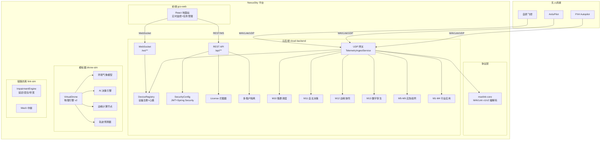
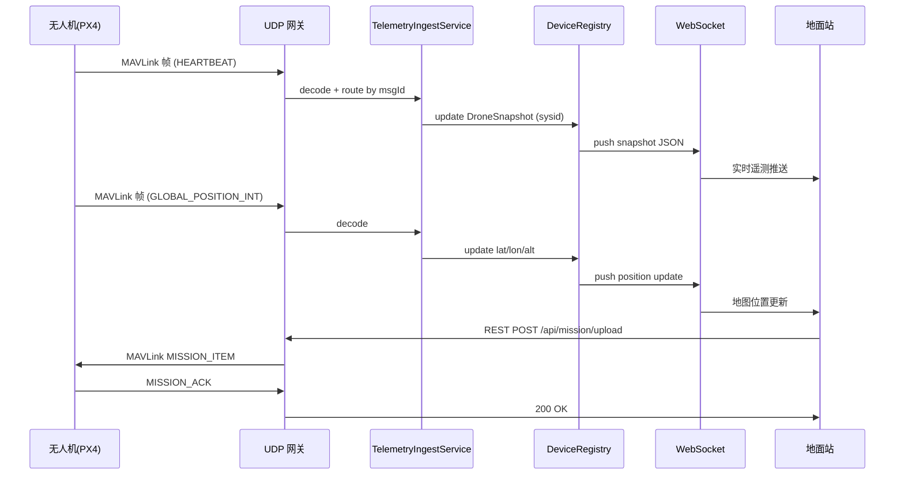
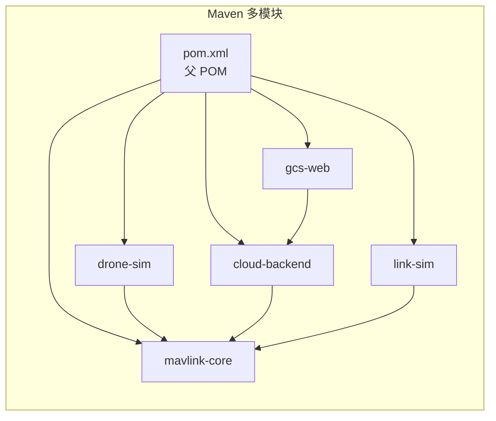
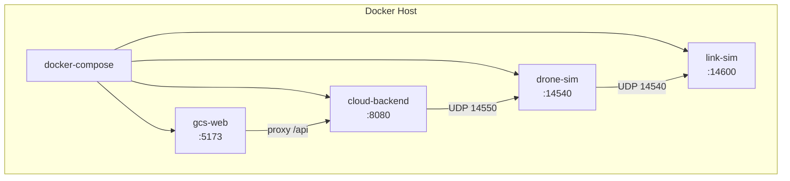
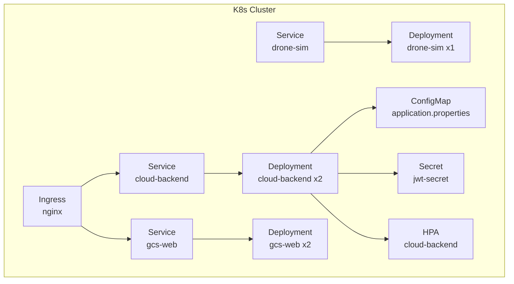
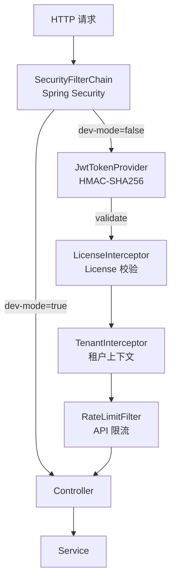

# NexusSky 系统架构

> **版本**：v1.0 | **日期**：2026-09-17

---

## 一、系统全景图

---

## 二、数据流图

---

## 三、模块依赖图

---

## 四、部署架构图

### 4.1 单机部署（docker-compose）

### 4.2 K8s 部署（Helm）

---

## 五、安全架构

---

## 六、MAVLink 消息注册表

| msgId | 消息 | 里程碑 | 说明 |
|---|---|---|---|
| 0-240 | 标准 MAVLink | — | HEARTBEAT/ATTITUDE/GLOBAL_POSITION_INT 等 |
| 420 | LedControlMsg | M1 | 灯光控制 |
| 421-422 | EnvironmentAlert/Status | M0b | 环境气象 |
| 423-426 | Spray/Gripper/Payload | M2 | 喷洒物流 |
| 430-434 | Obstacle/Multispectral/Thermal/Depth/Vision | M3 | 成像增强 |
| 437-441 | Radar/Rotor/LiDAR/IMU | M4 | 硬件抽象 |
| 450-454 | MeshHeartbeat/RouteReq/Reply/Err/Neighbor | M5 | mesh 组网 |
| 455-458 | CellTower/Handover/TerminalRegister | M6 | 移动基站 |
| 459-461 | SatLink/PassSchedule/HierarchicalRoute | M7 | 星地中继 |
| 462-464 | TerrainType/Update/FlightRestriction | M8 | 地形适配 |
| 465-467 | EmergencyMission/Coverage/Priority | M9 | 应急编排 |
| 468-470 | TaskAssignment/ConflictAlert/TaskStatus | M10 | 集群调度 |
| 471-472 | DecisionEvent/AdaptivePath | M11 | 自主决策 |
| 473-474 | EdgeTaskStatus/SensorFusionData | M12 | 边缘计算 |
| 475-476 | TwinStateSync/PredictionResult | M13 | 数字孪生 |